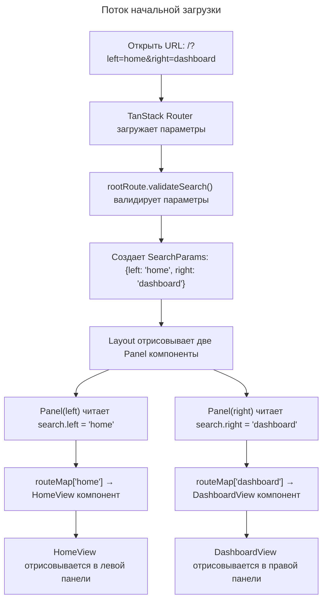
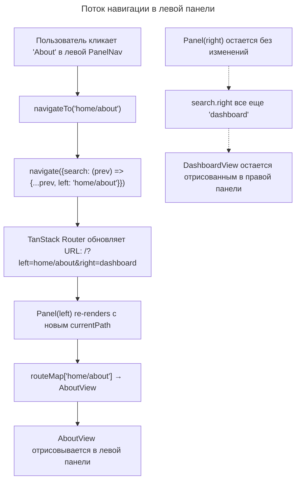
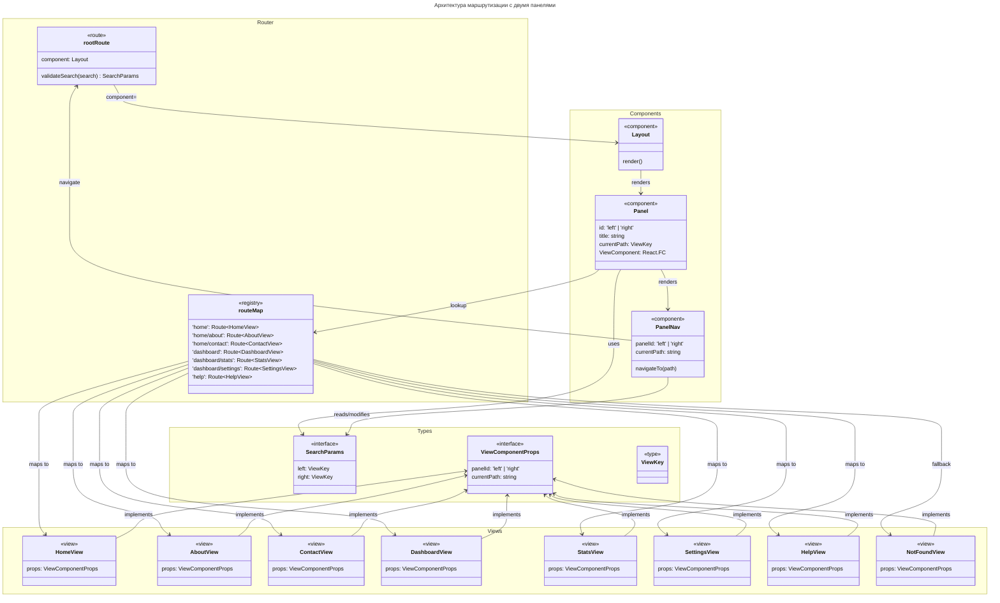

# C4 Уровень Кода: Splitstate Router

## Обзор

- **Название**: Архитектура маршрутизации с двумя независимыми панелями
- **Описание**: Система навигации, управляемая параметрами запроса, позволяющая независимую навигацию в двух параллельных окнах представлений с использованием TanStack Router
- **Местоположение**: `/Users/seigiard/Projects/splitstate-router`
- **Язык**: TypeScript, React 18+
- **Цель**: Демонстрация передовой архитектуры маршрутизации с независимыми состояниями навигации для левой и правой панелей через параметры URL-адреса

## Архитектурная концепция

Splitstate Router реализует **параметрическую навигацию вместо традиционной маршрутизации на основе пути**. Вместо того, чтобы URL-адрес выглядел как `/home/about`, он использует параметры поиска: `?left=home/about&right=dashboard/stats`. Это позволяет каждой панели поддерживать независимое состояние представления, управляемое одним URL-адресом.

### Ключевые принципы дизайна

1. **Разделение состояния**: Левая и правая панели имеют независимые состояния представлений
2. **Управление параметрами поиска**: Состояние управляется параметрами URL-адреса, а не историей маршрутов
3. **Валидация при корне**: Все параметры поиска валидируются при загрузке корневого маршрута
4. **Динамическое разрешение компонентов**: Вместо использования `<Outlet />`, компоненты представлений разрешаются вручную через `routeMap`
5. **Навигация с сохранением состояния**: При навигации в одной панели используется оператор распространения для сохранения состояния другой панели

---

## Элементы кода

### Типы и константы

#### `VIEW_KEYS` (Константа)
**Расположение**: `/Users/seigiard/Projects/splitstate-router/types.ts:1-9`

```typescript
export const VIEW_KEYS = [
  'home',
  'home/about',
  'home/contact',
  'dashboard',
  'dashboard/stats',
  'dashboard/settings',
  'help'
] as const;
```

- **Описание**: Перечисление всех доступных ключей представлений в приложении
- **Назначение**: Используется для валидации параметров поиска в корневом маршруте
- **Зависимости**: Тип `ViewKey` основан на этой константе

#### `ViewKey` (Тип)
**Расположение**: `/Users/seigiard/Projects/splitstate-router/types.ts:11`

```typescript
export type ViewKey = typeof VIEW_KEYS[number];
```

- **Описание**: Тип, производный от константы `VIEW_KEYS`, представляющий допустимые ключи представлений
- **Назначение**: Обеспечивает типобезопасность при работе с идентификаторами представлений
- **Значения**: `'home' | 'home/about' | 'home/contact' | 'dashboard' | 'dashboard/stats' | 'dashboard/settings' | 'help'`

#### `SearchParams` (Интерфейс)
**Расположение**: `/Users/seigiard/Projects/splitstate-router/types.ts:13-16`

```typescript
export interface SearchParams {
  left: ViewKey;
  right: ViewKey;
}
```

- **Описание**: Структура параметров поиска для корневого маршрута
- **Назначение**: Определяет контракт для состояния навигации обеих панелей
- **Поля**:
  - `left: ViewKey` — ключ представления для левой панели
  - `right: ViewKey` — ключ представления для правой панели

#### `ViewComponentProps` (Интерфейс)
**Расположение**: `/Users/seigiard/Projects/splitstate-router/types.ts:18-21`

```typescript
export interface ViewComponentProps {
  panelId: 'left' | 'right';
  currentPath: string;
}
```

- **Описание**: Свойства, переданные каждому компоненту представления
- **Назначение**: Предоставляет контекст компоненту о том, в какой панели он отрисовывается и какой путь активен
- **Поля**:
  - `panelId: 'left' | 'right'` — идентификатор панели, в которой отрисовывается компонент
  - `currentPath: string` — текущий ключ представления (например, `'home/about'`)

---

### Функции маршрутизации

#### `validateSearch` (Функция валидации)
**Расположение**: `/Users/seigiard/Projects/splitstate-router/router.tsx:14-24`

```typescript
validateSearch: (search: Record<string, unknown>): SearchParams => {
  const left = (typeof search.left === 'string' && VIEW_KEYS.includes(search.left as ViewKey))
    ? search.left as ViewKey
    : 'home';
  const right = (typeof search.right === 'string' && VIEW_KEYS.includes(search.right as ViewKey))
    ? search.right as ViewKey
    : 'dashboard';

  return { left, right };
}
```

- **Описание**: Валидирует и нормализует параметры поиска при загрузке маршрута
- **Назначение**: Гарантирует, что параметры `left` и `right` всегда содержат допустимые ключи представлений
- **Входные параметры**: `search: Record<string, unknown>` — сырые параметры из URL
- **Возвращаемое значение**: `SearchParams` — валидированная и нормализованная структура
- **Поведение**:
  - Проверяет наличие и тип каждого параметра
  - Проверяет, входит ли значение в `VIEW_KEYS`
  - Использует значения по умолчанию (`'home'` для левой, `'dashboard'` для правой) для невалидных параметров
- **Расположение в маршруте**: Часть `createRootRoute` options

#### `navigateTo` (Функция навигации в панели)
**Расположение**: `/Users/seigiard/Projects/splitstate-router/components/PanelNav.tsx:21-28`

```typescript
const navigateTo = (newPath: string) => {
  navigate({
    search: (prev) => ({
      ...prev,
      [panelId]: newPath,
    }),
  });
};
```

- **Описание**: Обновляет параметры поиска для конкретной панели, сохраняя состояние другой панели
- **Назначение**: Основной механизм навигации в пределах одной панели
- **Входные параметры**: `newPath: string` — новый ключ представления (например, `'home/about'`)
- **Возвращаемое значение**: `void` (навигация выполняется как побочный эффект)
- **Ключевой паттерн**: Оператор распространения (`...prev`) гарантирует, что состояние другой панели остается неизменным
- **Пример использования**:
  ```typescript
  // Навигация в левой панели к 'home/about', сохраняя правую панель на 'dashboard'
  navigateTo('home/about');
  // URL: ?left=home/about&right=dashboard
  ```

---

### Компоненты

#### `Layout` (Компонент)
**Расположение**: `/Users/seigiard/Projects/splitstate-router/components/Layout.tsx:5-19`

```typescript
export const Layout: React.FC = () => {
  return (
    <div className="flex flex-col md:flex-row h-screen w-full bg-background text-foreground overflow-hidden">
      <div className="flex-1 min-w-0 border-b md:border-b-0 md:border-r border-border">
        <Panel id="left" title="Left" />
      </div>

      <Separator orientation="vertical" className="hidden md:block" />

      <div className="flex-1 min-w-0">
        <Panel id="right" title="Right" />
      </div>
    </div>
  );
};
```

- **Описание**: Корневой компонент макета, отрисовывающий две панели
- **Назначение**: Обеспечивает двухколонный макет с адаптивным дизайном
- **Свойства**: Нет (компонент без свойств)
- **Зависимости**:
  - `Panel` — компонент панели для левого и правого представлений
  - `Separator` — визуальный разделитель между панелями
- **Поведение**:
  - На мобильных устройствах панели расположены вертикально (flex-col)
  - На планшетах и выше панели расположены горизонтально (md:flex-row) с вертикальным разделителем
  - Обе панели имеют одинаковую ширину (flex-1)
- **Расположение в иерархии**: Компонент корневого маршрута TanStack Router

#### `Panel` (Компонент контейнера панели)
**Расположение**: `/Users/seigiard/Projects/splitstate-router/components/Panel.tsx:14-43`

```typescript
export const Panel: React.FC<PanelProps> = ({ id, title }) => {
  const search = useSearch({ from: rootRoute.id });
  const currentPath = search[id] as ViewKey;

  const route = routeMap[currentPath];
  const ViewComponent = route?.options.component || NotFoundView;

  return (
    <div className="flex flex-col h-full overflow-hidden">
      <div className="p-4 border-b border-border bg-muted/50 sticky top-0 z-10">
        <div className="flex items-center justify-between mb-4">
          <h2 className="text-sm font-bold tracking-widest text-muted-foreground uppercase">
            {title} Panel
          </h2>
          <Badge variant="outline" className="font-mono text-xs">
            ?{id}={currentPath}
          </Badge>
        </div>

        <PanelNav panelId={id} currentPath={currentPath} />
      </div>

      <div className="flex-1 overflow-y-auto p-4">
        <div className="max-w-xl mx-auto w-full animate-in fade-in slide-in-from-bottom-2 duration-300">
          <ViewComponent panelId={id} currentPath={currentPath} />
        </div>
      </div>
    </div>
  );
};
```

- **Описание**: Контейнер панели, управляющий динамической отрисовкой представлений
- **Назначение**: Обеспечивает структурный контейнер и логику разрешения компонентов представлений
- **Свойства**:
  - `id: 'left' | 'right'` — идентификатор панели
  - `title: string` — отображаемый заголовок панели
- **Зависимости**:
  - `useSearch()` — хук TanStack Router для получения текущих параметров поиска
  - `rootRoute` — определение корневого маршрута для доступа к параметрам
  - `routeMap` — отображение для разрешения компонентов представлений
  - `NotFoundView` — fallback компонент при отсутствии представления
  - `PanelNav` — компонент навигации для этой панели
- **Поток выполнения**:
  1. Получить текущие параметры поиска из корневого маршрута
  2. Извлечь ключ представления для этой панели (`currentPath`)
  3. Найти компонент в `routeMap` по ключу представления
  4. Отрисовать компонент представления или `NotFoundView`, если ключ не найден
- **Ключевой паттерн**: Динамическое разрешение компонентов вместо использования TanStack Router `<Outlet />`
- **Визуальные элементы**:
  - Заголовок панели с отображаемым названием и текущим параметром URL
  - Компонент навигации (`PanelNav`) с кнопками и инструментами навигации
  - Область содержимого с анимацией входа

#### `PanelNav` (Компонент навигации)
**Расположение**: `/Users/seigiard/Projects/splitstate-router/components/PanelNav.tsx:13-106`

```typescript
export const PanelNav: React.FC<PanelNavProps> = ({ panelId, currentPath }) => {
  const navigate = useNavigate({ from: rootRoute.id });
  const search = useSearch({ from: rootRoute.id });

  const parentPath = currentPath.includes('/')
    ? currentPath.split('/').slice(0, -1).join('/')
    : null;

  const navigateTo = (newPath: string) => {
    navigate({
      search: (prev) => ({
        ...prev,
        [panelId]: newPath,
      }),
    });
  };

  const navItems = [
    { label: 'Home', path: 'home' },
    { label: 'Dash', path: 'dashboard' },
    { label: 'Help', path: 'help' },
  ];

  const subItems: Record<string, { label: string; path: string }[]> = {
    home: [
      { label: 'About', path: 'home/about' },
      { label: 'Contact', path: 'home/contact' },
    ],
    dashboard: [
      { label: 'Stats', path: 'dashboard/stats' },
      { label: 'Settings', path: 'dashboard/settings' },
    ],
  };

  const relevantSubItems = subItems[currentPath] || [];

  return (
    <div className="space-y-4">
      <div className="flex items-center gap-2 text-sm h-8">
        {parentPath && (
          <Button
            variant="ghost"
            size="sm"
            onClick={() => navigateTo(parentPath)}
            className="gap-1 pr-2"
          >
            <ArrowLeft className="w-4 h-4" /> Back
          </Button>
        )}
        <span className="text-muted-foreground font-mono text-xs uppercase tracking-wider">
          Current: <span className="text-primary">{currentPath}</span>
        </span>
      </div>

      <div className="flex gap-2 pb-2 overflow-x-auto">
        {navItems.map((item) => {
          const isActive = currentPath.startsWith(item.path);
          return (
            <Button
              key={item.path}
              variant={isActive ? 'default' : 'secondary'}
              size="sm"
              onClick={() => navigateTo(item.path)}
            >
              {item.label}
            </Button>
          );
        })}
      </div>

      {relevantSubItems.length > 0 && (
        <div className="flex flex-col gap-2 bg-muted/50 p-3 rounded-lg border border-border">
          <span className="text-xs font-semibold text-muted-foreground uppercase tracking-widest pl-1">
            Available Sub-Pages
          </span>
          <div className="flex flex-wrap gap-2">
            {relevantSubItems.map((sub) => (
              <Button
                key={sub.path}
                variant="outline"
                size="sm"
                onClick={() => navigateTo(sub.path)}
                className="gap-1"
              >
                {sub.label}
                <ChevronRight className="w-3 h-3" />
              </Button>
            ))}
          </div>
        </div>
      )}
    </div>
  );
};
```

- **Описание**: Компонент, обеспечивающий навигацию в пределах одной панели
- **Назначение**: Обеспечивает пользовательский интерфейс для навигации между представлениями
- **Свойства**:
  - `panelId: 'left' | 'right'` — идентификатор панели
  - `currentPath: string` — текущий ключ представления
- **Зависимости**:
  - `useNavigate()` — хук TanStack Router для программной навигации
  - `useSearch()` — хук TanStack Router для получения параметров поиска
  - `rootRoute` — определение корневого маршрута для навигации
- **Компоненты**:
  1. **Кнопка "Назад"** (условная):
     - Отрисовывается, если текущий путь вложен (содержит `/`)
     - Извлекает родительский путь (всё до последней `/`)
     - Навигирует к родительскому пути при нажатии

  2. **Основные элементы навигации**:
     - Три кнопки: Home, Dashboard, Help
     - Активная кнопка выделяется (variant='default')
     - Навигирует к корневому пути категории

  3. **Подэлементы** (условные):
     - Отрисовываются, если текущий путь имеет подстраницы
     - Например, при активной `'home'` показываются `'About'` и `'Contact'`
     - Отрисовываются в отдельной панели с визуальным отделением

---

### Компоненты представлений

**Расположение**: `/Users/seigiard/Projects/splitstate-router/views/registry.tsx`

Все компоненты представлений реализуют интерфейс `ViewComponentProps`.

#### `HomeView`
**Расположение**: `registry.tsx:20-32`
- **Описание**: Главная страница раздела Home
- **Содержимое**: Карточка приветствия с описанием
- **Дочерние представления**: `About`, `Contact`

#### `AboutView`
**Расположение**: `registry.tsx:34-49`
- **Описание**: Страница информации о проекте
- **Содержимое**: Карточка с описанием подхода маршрутизации

#### `ContactView`
**Расположение**: `registry.tsx:51-62`
- **Описание**: Форма контакта
- **Содержимое**: Форма с полями email и сообщения

#### `DashboardView`
**Расположение**: `registry.tsx:64-90`
- **Описание**: Главная панель управления
- **Содержимое**: Сетка карточек с метриками (активные пользователи, доход, статус системы)
- **Дочерние представления**: `Stats`, `Settings`

#### `StatsView`
**Расположение**: `registry.tsx:92-103`
- **Описание**: Подробные статистические данные
- **Содержимое**: Заполнитель для визуализации графиков

#### `SettingsView`
**Расположение**: `registry.tsx:105-117`
- **Описание**: Параметры панели управления
- **Содержимое**: Переключатель для управления уведомлениями

#### `HelpView`
**Расположение**: `registry.tsx:119-130`
- **Описание**: Справочная информация
- **Содержимое**: Справка по использованию независимой навигации панелей

#### `NotFoundView`
**Расположение**: `registry.tsx:132-144`
- **Описание**: Fallback представление для несуществующих путей
- **Содержимое**: Сообщение об ошибке с отображением запрошенного пути
- **Использование**: Используется в `Panel.tsx` как fallback при отсутствии представления в `routeMap`

---

### Объекты маршрутизации TanStack Router

#### `rootRoute` (Корневой маршрут)
**Расположение**: `/Users/seigiard/Projects/splitstate-router/router.tsx:12-24`

```typescript
export const rootRoute = createRootRoute({
  component: Layout,
  validateSearch: (search: Record<string, unknown>): SearchParams => {
    // ... валидация (см. выше)
  },
});
```

- **Описание**: Определение корневого маршрута для всего приложения
- **Компонент**: `Layout` — двухпанельный компонент
- **Валидация поиска**: Функция `validateSearch` валидирует параметры `left` и `right`
- **Назначение**: Центральная точка валидации всех параметров навигации

#### `routeMap` (Отображение маршрутов)
**Расположение**: `/Users/seigiard/Projects/splitstate-router/router.tsx:81-89`

```typescript
export const routeMap = {
  'home': homeRoute,
  'home/about': homeAboutRoute,
  'home/contact': homeContactRoute,
  'dashboard': dashboardRoute,
  'dashboard/stats': dashboardStatsRoute,
  'dashboard/settings': dashboardSettingsRoute,
  'help': helpRoute,
} as const;
```

- **Описание**: Объект, сопоставляющий ключи представлений с объектами маршрутов TanStack
- **Назначение**: Позволяет компоненту `Panel` динамически разрешать компоненты представлений по ключу
- **Тип**: `Record<ViewKey, RouteObject>` (с type const для полной типизации)
- **Использование**: `Panel.tsx:18` — `routeMap[currentPath]` для получения компонента

#### Отдельные маршруты
**Расположение**: `/Users/seigiard/Projects/splitstate-router/router.tsx:30-70`

Для каждого ключа представления в `VIEW_KEYS` создается маршрут:

```typescript
const homeRoute = createRoute({
  getParentRoute: () => rootRoute,
  path: 'home',
  component: Views.HomeView
});
```

- **Назначение**: Хотя пути не используются для навигации (используются параметры поиска), эти маршруты определяют компоненты и включаются в дерево маршрутов для полноты
- **Родитель**: Все маршруты имеют `rootRoute` как родителя
- **Компоненты**: Связаны с компонентами из `views/registry.tsx`

#### `router` (Экземпляр маршрутизатора)
**Расположение**: `/Users/seigiard/Projects/splitstate-router/router.tsx:98-101`

```typescript
export const router = createRouter({
  routeTree,
  defaultPreload: 'intent',
} as any);
```

- **Описание**: Экземпляр TanStack Router
- **Конфигурация**:
  - `routeTree` — полное дерево маршрутов со всеми маршрутами
  - `defaultPreload: 'intent'` — предзагрузка маршрутов при наведении курсора
- **Назначение**: Основной объект маршрутизатора, переданный `RouterProvider` в `App.tsx`

---

## Зависимости

### Внутренние зависимости

**Иерархия компонентов**:

```
Layout (корневой компонент)
├── Panel (левая)
│   ├── PanelNav
│   │   └── useNavigate()
│   │   └── useSearch()
│   └── ViewComponent (динамический, разрешен через routeMap)
│       └── HomeView | AboutView | ContactView | DashboardView | StatsView | SettingsView | HelpView | NotFoundView
└── Panel (правая)
    ├── PanelNav
    │   └── useNavigate()
    │   └── useSearch()
    └── ViewComponent (динамический, разрешен через routeMap)
        └── HomeView | AboutView | ContactView | DashboardView | StatsView | SettingsView | HelpView | NotFoundView
```

**Зависимости типов**:

- `types.ts` → `ViewKey`, `SearchParams`, `ViewComponentProps` используются во всех компонентах
- `router.tsx` → определяет `rootRoute`, `routeMap`, `router`, используемые в компонентах
- `views/registry.tsx` → экспортирует все компоненты представлений, импортируемые в `router.tsx`

### Внешние зависимости

- **@tanstack/react-router** (v2+)
  - `createRootRoute()` — создание корневого маршрута
  - `createRoute()` — создание отдельных маршрутов
  - `createRouter()` — создание экземпляра маршрутизатора
  - `RouterProvider` — провайдер маршрутизатора в `App.tsx`
  - `useSearch()` — хук для доступа к параметрам поиска
  - `useNavigate()` — хук для программной навигации

- **React** (v18+)
  - `React.FC` — типизация функциональных компонентов
  - JSX для отрисовки компонентов

- **lucide-react** — иконки
  - `Home`, `Settings`, `PieChart`, `Info`, `Phone`, `Activity`, `HelpCircle`, `ChevronRight`, `ArrowLeft`

- **UI компоненты** (определены в `components/ui/`)
  - `Card`, `CardContent`, `CardDescription`, `CardHeader`, `CardTitle`
  - `Badge`, `Button`, `Input`, `Textarea`, `Progress`, `Switch`, `Separator`

---

## Поток данных и навигация

### Сценарий 1: Начальная загрузка



### Сценарий 2: Навигация в левой панели



### Ключевой паттерн: Оператор распространения

Функция `navigateTo` использует оператор распространения (`...prev`) для сохранения состояния:

```typescript
navigate({
  search: (prev) => ({
    ...prev,                    // Копирует ВСЕ текущие параметры
    [panelId]: newPath,         // Переписывает только параметр для текущей панели
  }),
});
```

Это обеспечивает:
- **Независимость панелей**: Изменение в левой панели не влияет на правую
- **Сохранение состояния**: URL остается полным с обоими состояниями панелей
- **Простоту навигации**: Разработчики могут навигировать, не думая о другой панели

---

## Отличия от традиционной маршрутизации TanStack

### Традиционный подход (на основе пути)

```
URL: /home/about
├── Путь определяет активный маршрут
├── Используется <Outlet /> для отрисовки компонента маршрута
└── Только один активный маршрут может быть отрисован

Ограничение: Невозможно отрисовать два разных представления одновременно
```

### Подход Splitstate Router (на основе параметров поиска)

```
URL: /?left=home/about&right=dashboard
├── Параметры поиска определяют активные представления
├── Используется динамическое разрешение компонентов (routeMap lookup)
├── Можно отрисовать два разных представления одновременно
├── Каждое представление имеет независимое состояние
└── История браузера сохраняет оба состояния

Преимущества: Полная независимость панелей, одна история для обеих
```

### Динамическое разрешение компонентов

**Вместо этого** (традиционный TanStack Router):
```typescript
<Outlet /> // Отрисовывает компонент активного маршрута
```

**Используется это** (Splitstate Router):
```typescript
const route = routeMap[currentPath];
const ViewComponent = route?.options.component || NotFoundView;
<ViewComponent panelId={id} currentPath={currentPath} />
```

Преимущества:
- Полный контроль над компонентом, который отрисовывается
- Возможность отрисовать разные компоненты в одном компоненте `Panel`
- Простота добавления fallback логики

---

## Диаграмма архитектуры кода



---

## Диаграмма потока данных

```mermaid
---
title: Поток данных параметров и навигации
---
flowchart LR
    subgraph URL["URL & Параметры"]
        QueryString["?left=home&right=dashboard"]
    end

    subgraph Validation["Валидация (rootRoute)"]
        VS["validateSearch()"]
        SP["SearchParams{left, right}"]
    end

    subgraph PanelState["Состояние панелей"]
        LS["left: ViewKey"]
        RS["right: ViewKey"]
    end

    subgraph Resolution["Разрешение компонентов"]
        LR["routeMap lookup"]
        RR["routeMap lookup"]
        LC["ViewComponent (Left)"]
        RC["ViewComponent (Right)"]
    end

    subgraph Rendering["Отрисовка"]
        LV["HomeView (левая)"]
        RV["DashboardView (правая)"]
    end

    subgraph Navigation["Навигация"]
        Click["Клик на кнопку"]
        Navigate["navigate({search: {...prev, [panelId]: newPath}})"]
        UpdateURL["URL обновляется"]
    end

    QueryString --> VS
    VS --> SP
    SP --> LS
    SP --> RS
    LS --> LR
    RS --> RR
    LR --> LC
    RR --> RC
    LC --> LV
    RC --> RV
    Click --> Navigate
    Navigate --> UpdateURL
    UpdateURL --> QueryString
```



---

## Примеры использования

### Пример 1: Начальная навигация

```typescript
// URL: /?left=home&right=dashboard
// validateSearch() превращает это в:
const searchParams: SearchParams = {
  left: 'home',
  right: 'dashboard'
};

// Panel(left) отрисовывает:
const leftView = routeMap['home']?.options.component; // HomeView

// Panel(right) отрисовывает:
const rightView = routeMap['dashboard']?.options.component; // DashboardView
```

### Пример 2: Независимая навигация в левой панели

```typescript
// Пользователь кликает "About" в левой PanelNav
// В PanelNav компоненте:
const navigateTo = (newPath: string) => {
  navigate({
    search: (prev) => ({
      ...prev,              // { left: 'home', right: 'dashboard' }
      left: newPath,        // Переписывает только левую
    }),
  });
};

navigateTo('home/about');

// URL изменяется на: /?left=home/about&right=dashboard
// Левая панель теперь показывает AboutView
// Правая панель остается на DashboardView
```

### Пример 3: Обе панели навигируют независимо

```typescript
// Начальное состояние: ?left=home&right=dashboard
// Пользователь кликает "Stats" в правой панели
// URL: /?left=home&right=dashboard/stats

// Потом пользователь кликает "Contact" в левой панели
// URL: /?left=home/contact&right=dashboard/stats

// Обе панели имеют независимое состояние навигации в одном URL
```

---

## Ключевые решения по дизайну

### 1. Параметры поиска вместо путей

**Решение**: Использовать `?left=...&right=...` вместо конкретных путей

**Причины**:
- Позволяет хранить состояние обеих панелей в одном URL
- История браузера сохраняет оба состояния вместе
- Легко синхронизировать две независимые навигации

### 2. Валидация при корне

**Решение**: Использовать `validateSearch()` в `createRootRoute()`

**Причины**:
- Гарантирует, что все параметры валидированы перед использованием
- Предоставляет default значения для невалидных параметров
- Одна точка проверки для всего приложения

### 3. Динамическое разрешение компонентов

**Решение**: Использовать `routeMap` для lookup вместо `<Outlet />`

**Причины**:
- Позволяет отрисовать разные компоненты в одном контейнере
- Полный контроль над fallback логикой
- Не требует традиционной иерархии маршрутов для отрисовки

### 4. Оператор распространения для сохранения состояния

**Решение**: Использовать `{...prev, [panelId]: newPath}` в `navigateTo()`

**Причины**:
- Гарантирует, что состояние другой панели остается неизменным
- Разработчикам не нужно думать о состоянии другой панели
- Очень выразительно — ясно показывает намерение

### 5. Плоская структура маршрутов

**Решение**: Все маршруты являются прямыми потомками `rootRoute`, не вложены

**Причины**:
- Упрощает логику разрешения компонентов
- Избегает сложности иерархии маршрутов
- Хорошо подходит для параметрической навигации

---

## Расширяемость

### Добавление нового представления

1. **Добавить ключ в `types.ts`**:
   ```typescript
   export const VIEW_KEYS = [
     // ...существующие...
     'new-section',
     'new-section/detail',
   ] as const;
   ```

2. **Создать компонент представления в `views/registry.tsx`**:
   ```typescript
   export const NewSectionView: React.FC<ViewComponentProps> = ({ panelId, currentPath }) => (
     // компонент
   );
   ```

3. **Добавить маршрут в `router.tsx`**:
   ```typescript
   const newSectionRoute = createRoute({
     getParentRoute: () => rootRoute,
     path: 'new-section',
     component: Views.NewSectionView,
   });
   ```

4. **Добавить в `routeMap`**:
   ```typescript
   export const routeMap = {
     // ...существующие...
     'new-section': newSectionRoute,
   } as const;
   ```

### Добавление панели навигации для нового представления

В `PanelNav.tsx` в объекте `subItems`:
```typescript
const subItems: Record<string, { label: string; path: string }[]> = {
  // ...существующие...
  'new-section': [
    { label: 'Detail', path: 'new-section/detail' },
  ],
};
```

---

## Потенциальные оптимизации

1. **Кэширование компонентов представлений**: Использовать `React.memo()` для предотвращения ненужных re-renders
2. **Ленивая загрузка**: Использовать `React.lazy()` и `Suspense` для кодового разделения
3. **Сохранение состояния представлений**: Добавить механизм для сохранения состояния компонентов при переключении между представлениями
4. **История в пределах панели**: Добавить локальную историю для каждой панели помимо глобальной истории браузера

---

## Примечания и контекст

- **Язык**: Проект использует TypeScript для типобезопасности и лучшей разработки
- **Фреймворк**: React 18+ с функциональными компонентами и хуками
- **Маршрутизатор**: TanStack Router (современная альтернатива React Router v6+)
- **Стилизация**: Tailwind CSS с компонентами UI (использует Radix UI под капотом)
- **Назначение**: Демонстрация передовой архитектуры маршрутизации для двухпанельных интерфейсов
- **Преимущество**: Один URL хранит состояние обеих панелей, история браузера синхронизирует обе панели вместе

---

## Файловая структура кода

```
/Users/seigiard/Projects/splitstate-router/
├── types.ts                          # Типы: VIEW_KEYS, ViewKey, SearchParams, ViewComponentProps
├── router.tsx                        # rootRoute, routeMap, router, validateSearch
├── components/
│   ├── Layout.tsx                    # Двухпанельный макет
│   ├── Panel.tsx                     # Контейнер панели с разрешением компонентов
│   ├── PanelNav.tsx                  # Навигация в пределах панели
│   └── ui/                           # UI компоненты (Button, Card, Badge, и т.д.)
├── views/
│   └── registry.tsx                  # Все компоненты представлений
├── App.tsx                           # RouterProvider обертка
└── vite.config.ts                    # Конфигурация сборки
```
